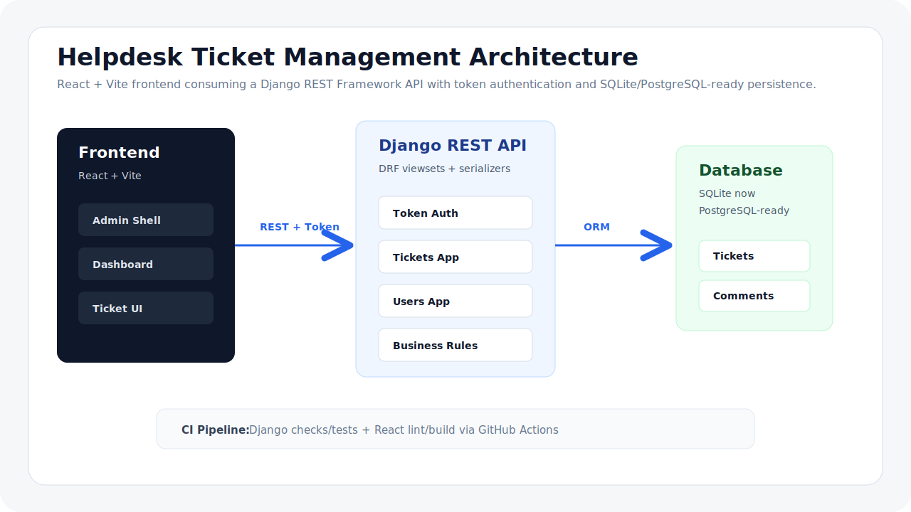

# Helpdesk Ticket Management



A full-stack Helpdesk and Ticket Management system built as a portfolio-grade project. It is inspired by real corporate service desk tools used for internal support, ticket triage, operational visibility and customer request management.

The project combines a Django REST Framework API with a modern React + Vite administrative interface, role-aware workflows, ticket timelines, dashboard metrics, token authentication and a clean SaaS-style UI.

## Highlights

- Full-stack Helpdesk application with RESTful API
- React + Vite frontend with responsive administrative layout
- Django REST Framework backend with token authentication
- User roles: `admin`, `agent`, `customer`
- Ticket lifecycle: `open`, `in_progress`, `resolved`, `closed`, `cancelled`
- Priorities: `low`, `medium`, `high`, `critical`
- Ticket comments and status history timeline
- Dashboard with operational metrics
- Paginated ticket API with search and filters
- Category and user management
- SQLite for local development
- PostgreSQL-ready configuration through environment variables
- GitHub Actions CI for backend and frontend validation

## Tech Stack

| Layer | Technology |
| --- | --- |
| Frontend | React, Vite, JavaScript, CSS |
| Backend | Django, Django REST Framework |
| Authentication | DRF Token Authentication |
| Database | SQLite locally, PostgreSQL-ready |
| Tooling | npm, Python virtual environment |
| CI | GitHub Actions |

## Architecture

The application follows a clear separation of responsibilities:

- The React frontend renders the SaaS-style interface and centralizes API calls in a service layer.
- The Django REST API owns authentication, permissions, validation and business rules.
- The `tickets` app manages tickets, categories, comments and status history.
- The `users` app manages authentication and user-facing role boundaries while keeping Django's built-in `auth.User`.
- The database is SQLite by default, with settings prepared for PostgreSQL.

## Main Features

### Authentication And Roles

- Login and registration
- Token-based authenticated requests
- Role-aware API and interface behavior
- Admin and agent access to operational management
- Customer access focused on ticket creation and follow-up

### Tickets

Each ticket includes:

- title and description
- status and priority
- category
- requester
- assigned agent
- creation, update and closure timestamps
- comments
- status history

Business rules enforced by the backend:

- new tickets always start as `open`
- customers cannot change status or assignee
- closed tickets cannot be edited freely
- cancelled and closed tickets cannot receive comments
- resolved tickets can be closed or moved back to `in_progress`

### Frontend Experience

- Dark operational sidebar
- Responsive topbar and admin shell
- Dashboard metric cards
- Dense tables with hover states
- Semantic status and priority badges
- Ticket detail page with metadata cards, timeline and edit form
- Reusable loading, empty and error states
- Mobile navigation and responsive table handling

## Project Structure

```text
helpdesk-backend/
|-- .github/workflows/      # CI pipeline
|-- docs/                   # Architecture diagram and project assets
|-- helpdesk_api/           # Django project configuration
|-- tickets/                # Tickets, categories, comments and history
|-- users/                  # Auth, users and role serializers/views
|-- helpdesk-frontend/      # React + Vite frontend
|-- manage.py
|-- requirements.txt
`-- README.md
```

## Getting Started

### Backend

```bash
cd D:\helpdesk-backend
copy .env.example .env
.\.venv\Scripts\python.exe manage.py migrate
.\.venv\Scripts\python.exe manage.py seed_demo_data
.\.venv\Scripts\python.exe manage.py runserver
```

Backend URL:

```text
http://127.0.0.1:8000/api/
```

### Frontend

```bash
cd D:\helpdesk-backend\helpdesk-frontend
npm install
npm run dev
```

Frontend URL:

```text
http://127.0.0.1:5173
```

Demo login:

```text
admin / 123
```

## API Overview

| Method | Endpoint | Description |
| --- | --- | --- |
| `POST` | `/api/auth/login/` | Authenticate and return token |
| `POST` | `/api/auth/register/` | Create user account |
| `GET` / `POST` | `/api/users/` | List or create users |
| `GET` / `POST` | `/api/categories/` | List or create categories |
| `GET` / `POST` | `/api/tickets/` | List or create tickets |
| `GET` / `PATCH` / `DELETE` | `/api/tickets/{id}/` | Ticket detail operations |
| `GET` | `/api/tickets/dashboard/` | Dashboard metrics |
| `GET` | `/api/tickets/{id}/history/` | Ticket status history |
| `GET` / `POST` | `/api/tickets/{id}/comments/` | Ticket comments |

Authenticated requests use:

```text
Authorization: Token <token>
```

Ticket list examples:

```text
GET /api/tickets/?page=1&page_size=8
GET /api/tickets/?status=open&priority=critical&ordering=-created_at
GET /api/tickets/?search=vpn&page=2&page_size=8
```

## Environment Configuration

Local development uses SQLite by default. PostgreSQL can be enabled through `.env`:

```text
DB_ENGINE=postgres
POSTGRES_DB=helpdesk
POSTGRES_USER=helpdesk
POSTGRES_PASSWORD=helpdesk
POSTGRES_HOST=127.0.0.1
POSTGRES_PORT=5432
```

## Quality Checks

Backend:

```bash
.\.venv\Scripts\python.exe manage.py check
.\.venv\Scripts\python.exe manage.py test
```

Frontend:

```bash
cd helpdesk-frontend
npm run lint
npm run build
```

## CI

The repository includes GitHub Actions workflow support:

- backend: Django system check and test suite
- frontend: ESLint and production build

Workflow file:

```text
.github/workflows/ci.yml
```

## Portfolio Talking Points

- Clear frontend/backend separation
- REST API design with Django REST Framework
- Token-based authentication
- Role-aware business rules
- Serializer-level validation
- Query optimization using `select_related`
- Paginated API and centralized frontend service layer
- Professional SaaS-style UI system
- CI pipeline for automated validation

## Future Improvements

- JWT authentication with refresh tokens
- Production deployment documentation
- PostgreSQL Docker Compose profile
- TypeScript migration for stronger frontend contracts
- Dedicated reports page with charts
- End-to-end tests for critical ticket workflows
